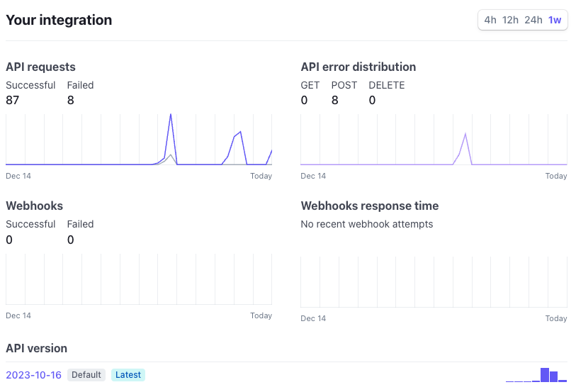
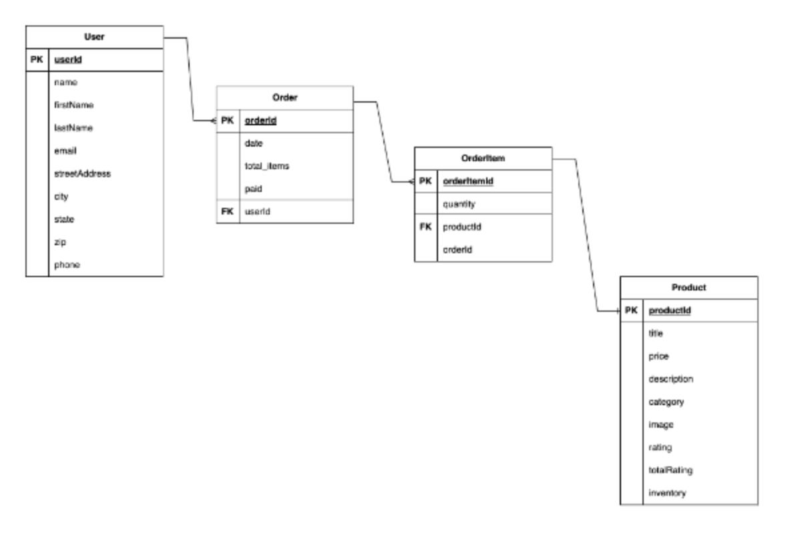
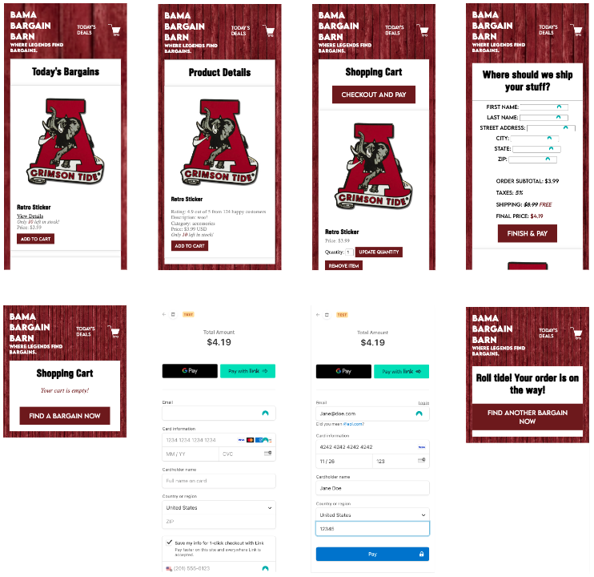
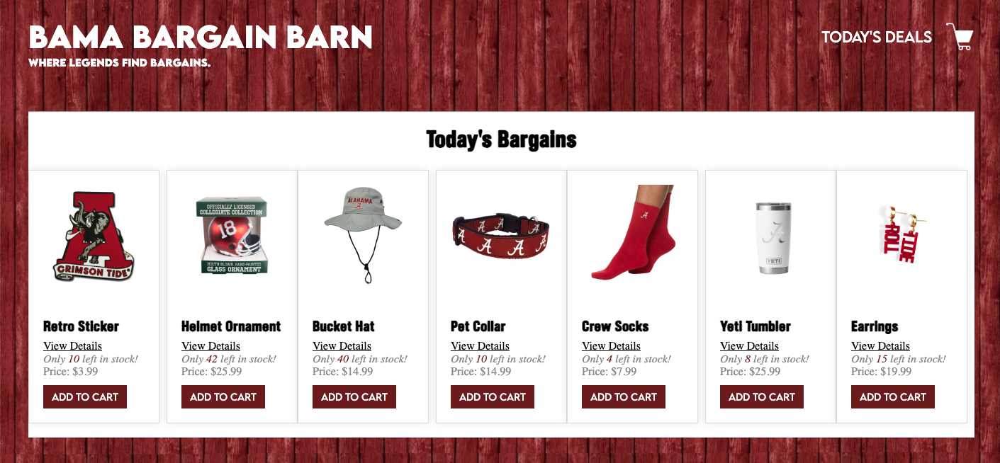
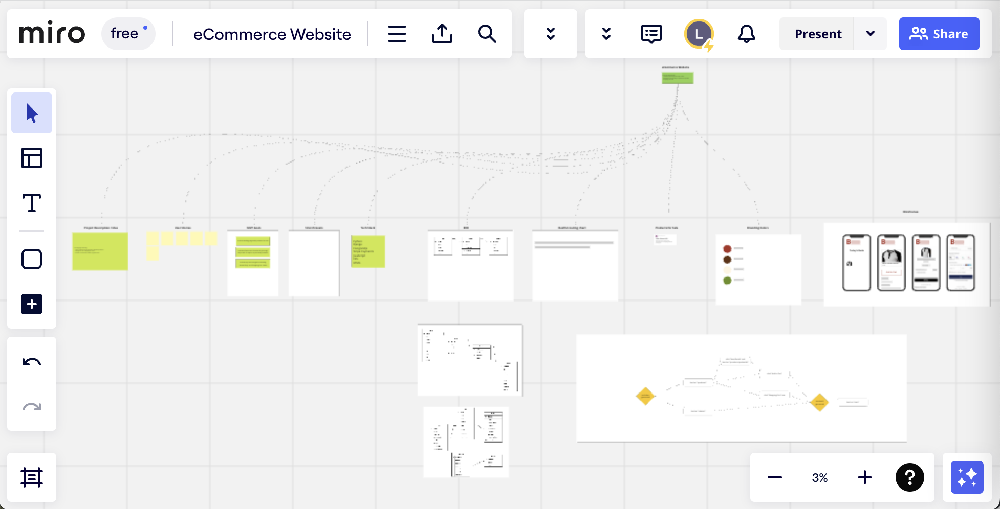
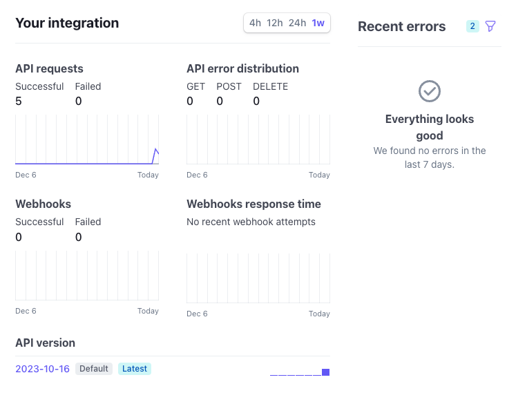
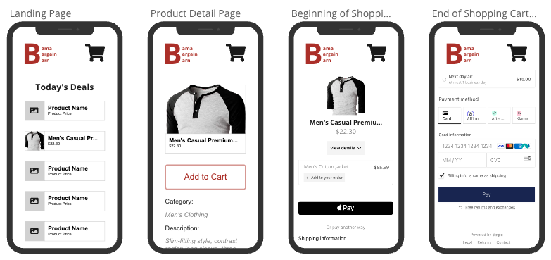
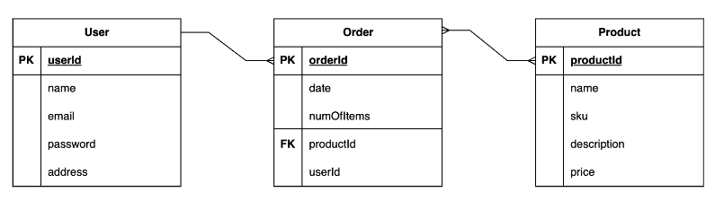

# 
An eCommerce web application by Leah Livingston

---
### **Project Description**

🐴 Howdy 🤠 and welcome to the "Bama Bargain Barn" an online eCommerce web application where you can buy from our current inventory of Alabama Football merchandise <i>cough Roll Tide cough </i>. 

[Click Here to Check out the Shop Now](https://bamabargainbarn.vercel.app/)

---
### **Tech Stack**
It's a responsive eCommerce web application (soon to be hosted on Heroku) utilizing Django with Python, PostgreSQL, HTML, CSS, and the payments API from [Stripe](https://stripe.com/docs/development/quickstart?lang=python).

###### **API Details**
The [Stripe](https://stripe.com/docs/implementation-guides/core-payments) payments API is connected via test mode only. Currently, I have successfully connected to the API, setup a shopping cart, checkout, and pay views. With the test credit card information, it's possible to see the successful and cancel payment paths, but there is a small issue with the webhook that needs to be debugged to update inventory and clear out the shopping cart after purchase.

---
### **ERDs**

---
### **Restful Routing Chart**

| HTTP METHOD | URL | CRUD | Response | Notes |
| -------------------- | ------------- | ---- | -------- | ----- |
| `full index of items`  |   |   |   |   |
| GET | `/products` | Read | View Products | retrieves available products in database  |
| GET | `/products/:product_id` | Read | View Product Details | retrieves detailed information on product  |
| POST | `/cart` | Read | View Cart | retrieves items in shopping cart  |
| POST | `/cart/add/:product_id` | Create | Add to Cart | adds a product to shopping cart  |
| POST | `/cart/update/:order_id` | Update | Update Quantity | updates quantity of product in shopping cart  |
| POST | `/cart/delete/:order_id` | Delete | Remove Item | removes item from shopping cart  |
| GET | `/cart/checkout/:order_id` | Read | Review Order | retrieves order to provide shipping details |
| GET | `/stripe-webhook` | Read | Stripe Webhook | calls payment API to process payment  |
| GET | `/cart/checkout/:order_id/pay` | Read | Pay | retrieves Stripe Checkout to pay |
| GET | `/cart/checkout/:order_id/success` | Read | Order Confirmation | confirms order was received |
| GET | `/cart/checkout/:order_id/cancel` | Read | Leave Checkout | retrieves "Review Order" view |

---
### **Wireframes (Mobile View)**

##### Mobile View

##### Desktop View

---
###  **Credit**
A big thank you to Weston Bailey, April Gonzalez, Tom Kolsrud, & Ben Manley for your support, as well as the University of Alabama football dynasty and the Legend, Nick Saban, for the inspiration. Roll tide baby!

---
### **Next Steps**

##### Style
- [ ] Clean up CSS and responsiveness for better user experience in mobile and desktop
- [ ] Include a 'Brand Kit' for future development use
- [ ] Improve CSS styling following said 'Brand Kit'
- [ ] Include newsletter sign-up option in top navigation

##### Functionality
- [ ] Complete backend inventory logic to ensure inventory is correct after purchases (webhook issue)
- [ ] Include ability to create a new user profile upon purchase of a product
- [ ] Include ability for user to view their profile
- [ ] Include ability for user to view past purchases
- [ ] Include ability for user to log-out
- [ ] Includes newsletter sign-up functionality
- [ ] Include functionality that allows each user to only see their own data
- [ ] Include ability to log-in via oAuth in top navigation

[Click Here to Check out the Shop Now](https://bamabargainbarn.vercel.app/)

---
# **Planning Materials & Original Pitch below**

### **Brainstorm**
I utilized utilized MIRO for brainstorming, strategizing, planning, and tracking development progress.

---
### **Tech Stack**

My goal for the capstone project was to add a well-rounded fourth piece to my Github portfolio. The idea was to create a responsive eCommerce web application hosted on Heroku utilizing Django with Python, React, PostgreSQL, HTML, CSS, and the payments API from Stripe.

###### **API Details**

The [Stripe](https://stripe.com/docs/implementation-guides/core-payments) payments API will be connected via test mode only. Currently, I have successfully connected to the API, but haven't created the user view yet.

---
### **Description**

The end result will be a responsive website with the ability to purchase one or several products for sale at the "Bama Bargain Barn". The project is designed to be simple, while showing off my new skills in: 

1. Django
2. Python
3. PostgreSQL, and
4. eCommerce functionality through utilization of the [Stripe](https://stripe.com/docs/development/quickstart?lang=python) payments API. 

---
### **Wireframes (Mobile View)**

---
### **ERD**

---
### **Restful Routing Chart**

| HTTP METHOD | URL | CRUD | Response | Notes |
| -------------------- | ------------- | ---- | -------- | ----- |
| `full index of items`  |   |   |   |   |
| GET | `/products` | Read | View Products | retrieves available products in database  |
| GET | `/products/:product_id` | Read | View Product Details | retrieves detailed information on product  |
| POST | `/cart` | Create | Add to Cart | add product to shopping cart  |
| GET | `/checkout` | Read | Review Order | review order, provide shipping details, and pay |
| GET | `/fetch-stripe-data` | Read | Connect to Stripe | calls payment API to process payment  |

---
### **Sprint Schedule**

The projected schedule will be as follows:

- [X] Day 1 (12/14 - Thurs.): Complete file structure setup
- [X] Day 2 (12/15 - Fri.):   Complete models, urls, views, and test data setup 
- [X] Day 3 (12/16 - Sat.):   Complete necessary html and css for basic navigation  
- [X] Day 4 (12/17 - Sun.):   Create Product, Shopping Cart, and Checkout views
- [X] Day 5 (12/18 - Mon.):   Create "Pay Now" button and connect Stripe payments API
- [X] Day 6 (12/19 - Tues.):  Complete eCommerce functionality (data connection and styling)
- [X] Day 7 (12/20 - Wed.):   Polish CSS styling
- [X] Day 8 (12/21 - Thurs.): Presentation   

---
### **MVP Goals**

###### User Stories
- [X] AAU, I want to see products for sale on a landing page without having to log-in.
- [X] AAU, I want to see how many items are left in the inventory for each product.
- [X] AAU, I want the ability to add a product to the shopping cart without having to log-in.
- [X] AAU, I want the ability to delete a product to the shopping cart, also without having to log-in.
- [X] AAU, I want the ability to leave the shop url and come back within 24h to find my items still in the shopping cart.
- [X] AAU, I want the ability to purchase a product.

###### Style
- [X] Include basic CSS to successfully utilize the web application
- [X] Include top navigation, including: 'Products' and 'Shopping Cart' page links
- [X] Include two individual page views, including: 'Proucts' and 'Shopping Cart' screens
- [X] Create Pay Now button on Checkout page
- [ ] Include visual optimization for mobile view

###### Functionality
- [X] Include shopping cart functionality 
- [X] Include Stripe payments API for ability to purchase a product 
- [X] Connect Pay Now button on Stripe Payments API to see what view is provided.

---
### **Stretch Goals**

###### User Stories
- [ ] AAU, I want the ability to create a profile once I'm ready to purchase something.
- [ ] AAU, I want the ability to log-in and reference my past purchases.
- [ ] AAU, I do not want other users to see my purchase history.
- [ ] AAU, I the ability to sign-up for a newsletter to get email updates about new products.
- [ ] AAU, I want the ability to log-out.

###### Style
- [ ] Include a 'Brand Kit' for future development use
- [ ] Include CSS styling following a 'Brand Kit'
- [ ] Include visual optimization for desktop and tablet
- [ ] Include newsletter sign-up option in top navigation

###### Functionality
- [ ] Include ability to create a new user profile upon purchase of a product
- [ ] Include ability for user to view their profile
- [ ] Include ability for user to view past purchases
- [ ] Include ability for user to log-out
- [ ] Includes newsletter sign-up functionality
- [ ] Include functionality that allows each user to only see their own data
- [ ] Include ability to log-in via oAuth in top navigation