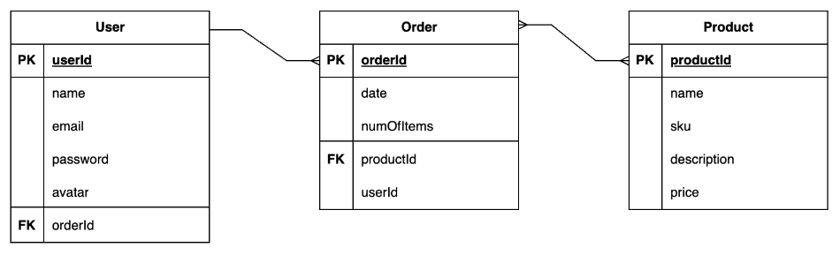

# 
An eCommerce web application created by Leah Livingston.

[Click Here to Check out the Web Application Now]('change to app link"https://fitforecast-dc33e66f392f.herokuapp.com/"')

---
### **Project Idea and Description**

My goal for the capstone project is to add a well-rounded fourth piece to my Github portfolio. The idea is to keep it simple, while showing off new skills: 
1. Django
2. Python
3. PostgreSQL, and
4. an eCommerce functionality utilizing the API from [Stripe](https://stripe.com/docs/development/quickstart?lang=python) 

Without a clear picture on the details, the idea is to build a responsive website with the ability to purchase a product. 

[Click Here to Check out the Web Application Now]('change to app link"https://fitforecast-dc33e66f392f.herokuapp.com/"')

---
### **Tech Stack**
It will be a responsive eCommerce web application hosted on Heroku utilizing Django with Python, React, PostgreSQL, HTML, CSS, and the payments API from Stripe.

###### **API Details**
The web application utilizes two third-party APIs. The first is for payments from [Stripe](https://stripe.com/docs/implementation-guides/core-payments) (which allows free test development).

[ADD MORE DESCRIPTION HERE ONCE GETTING SETUP]

---
### **ERD**

---
### **Restful Routing Chart**

| HTTP METHOD | URL | CRUD | Response | Notes |
| -------------------- | ------------- | ---- | -------- | ----- |
| `full index of items`  |   |   |   |   |
| GET | `/fetch-stripe-data` | Read | View API connection | retrieves ability to process payments  |

---
### **Screenshots of the Web Application**

###### **Home Page**

---
### **Credit**

A big thank you to Weston Bailey, April Gonzalez, Tom Kolsrud, and Ben Manley for your support. 

---
### **MVP Goals**

###### User Stories
- [ ] AAU, I want to see information on a landing page without having to log-in.
- [ ] AAU, I want the ability to purchase a product.

###### Style
- [ ] Include basic CSS to successfully utilize the web application
- [ ] Include top hamburger navigation including 'Home', 'Shop', and 'Shopping Cart' page links
- [ ] Include 3 individual page views, including:  'Home', 'Shop', and 'Shopping Cart' screens
- [ ] Include visual optimization for mobile view

###### Functionality
- [ ] Include shopping cart functionality 
- [ ] Include Stripe payments API for ability to purchase a product 

---
### **Stretch Goals**

###### User Stories
- [ ] AAU, I want the ability to create a profile once I'm ready to purchase something.
- [ ] AAU, I want the ability to log-in and reference my past purchases.
- [ ] AAU, I do not want other users to see my purchase history.
- [ ] AAU, I the ability to sign-up for a newsletter to get email updates about new products.
- [ ] AAU, I want the ability to log-out.

###### Style
- [ ] Include a 'Brand Kit' for future development use
- [ ] Include CSS styling following a 'Brand Kit'
- [ ] Include visual optimization for desktop and tablet
- [ ] Include newsletter sign-up option in top navigation

###### Functionality
- [ ] Include ability to create a new user profile upon purchase of a product
- [ ] Include ability for user to view their profile
- [ ] Include ability for user to view past purchases
- [ ] Include ability for user to log-out
- [ ] Includes newsletter sign-up functionality
- [ ] Include functionality that allows each user to only see their own data
- [ ] Include ability to log-in via oAuth in top navigation