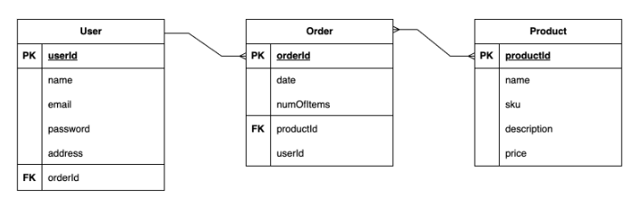

# **Bama Bargain Barn Pitch**
An eCommerce web application created by Leah Livingston

---
### **Tech Stack**
My goal for the capstone project is to add a well-rounded fourth piece to my Github portfolio. The idea is to create a responsive eCommerce web application hosted on Heroku utilizing Django with Python, React, PostgreSQL, HTML, CSS, and the payments API from [Stripe](https://stripe.com/docs/implementation-guides/core-payments).

---
### **Description**

The end result will be a responsive website with the ability to purchase one or several products for sale at the "Bama Bargain Barn". The project is designed to be simple, while showing off my new skills in: 

1. Django
2. Python
3. PostgreSQL, and
4. eCommerce functionality through utilization of the [Stripe](https://stripe.com/docs/development/quickstart?lang=python) payments API. 

---
### **Wireframes (Mobile View)**

---
### **ERD**

---
### **Restful Routing Chart**

| HTTP METHOD | URL | CRUD | Response | Notes |
| -------------------- | ------------- | ---- | -------- | ----- |
| `full index of items`  |   |   |   |   |
| GET | `/fetch-stripe-data` | Read | View API connection | retrieves ability to process payments  |

---
### **Sprint Schedule**

The projected schedule will be as follows:

- Day 1 (12/14 - Thurs.): Complete file structure setup
- Day 2 (12/15 - Fri.):   Complete models, urls, views, and test data setup 
- Day 3 (12/16 - Sat.):   Complete necessary html and css for basic navigation  
- Day 4 (12/17 - Sun.):   Connect Stripe payments API
- Day 5 (12/18 - Mon.):   Create Shopping Cart and Checkout features
- Day 6 (12/19 - Tues.):  Complete eCommerce functionality
- Day 7 (12/20 - Wed.):   Polish CSS styling
- Day 8 (12/21 - Thurs.): Presentation   

---
### **MVP Goals**

###### User Stories
- [ ] AAU, I want to see products for sale on a landing page without having to log-in.
- [ ] AAU, I want the ability to purchase a product.

###### Style
- [ ] Include basic CSS to successfully utilize the web application
- [ ] Include top hamburger navigation, including: 'Home' and 'Shopping Cart' page links
- [ ] Include two individual page views, including:  'Home' and 'Shopping Cart' screens
- [ ] Include visual optimization for mobile view

###### Functionality
- [ ] Include Stripe payments API for ability to purchase a product 
- [ ] Include shopping cart functionality 

---
### **Stretch Goals**

###### User Stories
- [ ] AAU, I want the ability to create a profile once I'm ready to purchase something.
- [ ] AAU, I want the ability to log-in and reference my past purchases.
- [ ] AAU, I do not want other users to see my purchase history.
- [ ] AAU, I the ability to sign-up for a newsletter to get email updates about new products.
- [ ] AAU, I want the ability to log-out.

###### Style
- [ ] Include a 'Brand Kit' for future development use
- [ ] Include CSS styling following a 'Brand Kit'
- [ ] Include visual optimization for desktop and tablet
- [ ] Include newsletter sign-up option in top navigation

###### Functionality
- [ ] Include ability to create a new user profile upon purchase of a product
- [ ] Include ability for user to view their profile
- [ ] Include ability for user to view past purchases
- [ ] Include ability for user to log-out
- [ ] Includes newsletter sign-up functionality
- [ ] Include functionality that allows each user to only see their own data
- [ ] Include ability to log-in via oAuth in top navigation