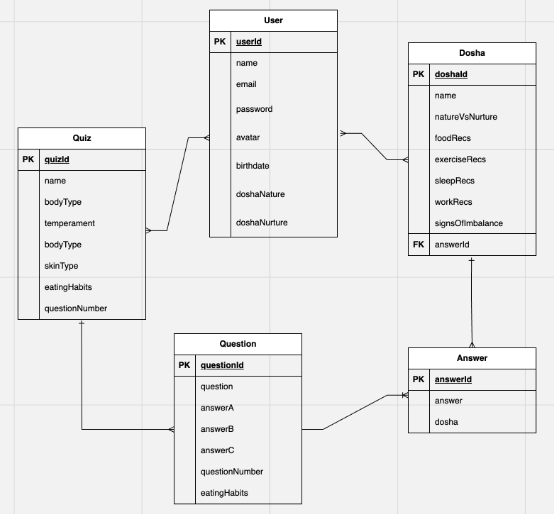

# 
An eCommerce web application created by Leah Livingston.

[Click Here to Check out the App Now]('change to app link"https://fitforecast-dc33e66f392f.herokuapp.com/"')

---
### **Project Idea and Description**

My goal for the capstone project is to add a well-rounded fourth piece to my Github portfolio. The idea is to keep it simple, while showing off new skills: 
1. Django
2. Python
3. PostgreSQL, and
4. an eCommerce functionality utilizing the API from [Stripe](https://stripe.com/docs/development/quickstart?lang=python) 

Without a clear picture on the details, the idea is to build a responsive website with the ability to take a quiz to learn your Ayurvedic dosha type. The quiz ends by dynamically re-directing to a landing URL that provides educational content specific to that dosha type. Along with diet, exercise, sleep, and work recommendations, the web application will include a prompt to buy a traditional Ayurvedic copper tongue scraper as the eCommerce element.

[Click Here to Check out the App Now]('change to app link"https://fitforecast-dc33e66f392f.herokuapp.com/"')

---
### **Tech Stack**
It will be a responsive eCommerce web application hosted on Heroku utilizing Django with Python, React, PostgreSQL, HTML, CSS, and the payments API from Stripe.

###### **API Details**
The application utilizes the third-party API from [Stripe](https://stripe.com/docs) (which allows free test development). 

[ADD MORE DESCRIPTION HERE ONCE GETTING SETUP]

---
### **ERD**

---
### **Restful Routing Chart**

| HTTP METHOD | URL | CRUD | Response | Notes |
| -------------------- | ------------- | ---- | -------- | ----- |
| `full index of items`  |   |   |   |   |
| GET | `/` | Read | View Dosha | retrieves dosha information  |
| GET | `/fetch-stripe-data` | Read | View API connection | retrieves ability to process payments  |

---
### **Screenshots of the Web Application**

###### Home Page

---
### **Credit**

A big thank you to Weston Bailey, Rondell Charles, April Gonzalez, Tom Kolsrud, and Ben Manley for your support. 

---
### **MVP Goals**

###### User Stories
- [ ] AAU, I want to learn how to equalize my body's unique constitution to enjoy a balanced mind, body, and spirit.
- [ ] AAU, I want to see information on a landing page without having to log-in.
- [ ] AAU, I want the ability to take a quiz to learn my Ayurvedic dosha type.
- [ ] AAU, I want the web application to determine my dosha type based upon my provided answers from the quiz.
- [ ] AAU, I want the application to suggest a food recommendations, exercise routines, and other preventative health methods based upon my dosha type.
- [ ] AAU, I want the ability to purchase a traditional Ayurvedic copper tongue scraper.

###### Style
- [ ] Include basic CSS to successfully utilize the web application
- [ ] Include top hamburger navigation including 'Home', 'Take Quiz', and 'Shopping Cart' page links
- [ ] Include 15 individual page views, including:  'Home', 'Quiz', 'Your Dosha', and 'Shopping Cart' screens
- [ ] Include visual optimization for mobile view

###### Functionality
- [ ] Include educational information about Ayurveda and prompt to start quiz on landing page
- [ ] Include a quiz (max. 10. questions) that will determine dosha type based off provided answers
- [ ] Include ability for application to dynamically end quiz on that dosha type's page based on my dosha type
- [ ] Include educational content for each of the three dosha types
- [ ] Include opportunity to purchase a retail product
- [ ] Include shopping cart functionality 
- [ ] Include Stripe payments API 

---
### **Stretch Goals**

###### User Stories
- [ ] AAU, I want the ability to search the web application via a search bar, regardless of what page I'm on.
- [ ] AAU, I want the ability to create a profile once I'm ready to purchase something.
- [ ] AAU, I want the ability to log-in and reference my dosha type and the recommendations from time to time.
- [ ] AAU, I want the ability to re-take the quiz and the web application tracks changes in my constitution over time.
- [ ] AAU, I do not want other users to see my quiz results or purchase history.
- [ ] AAU, I want my lifestyle recommendations to update over time as I update my data.
- [ ] AAU, I want the ability to log-out.

###### Style
- [ ] Include a 'Brand Kit' for future development use
- [ ] Include CSS styling following a 'Brand Kit'
- [ ] Include visual optimization for desktop and tablet
- [ ] Include search bar in the top navigation
- [ ] Include newsletter sign-up option in top navigation

###### Functionality
- [ ] Includes ability to search website application via a search bar
- [ ] Includes newsletter 
- [ ] Include ability to create a new user profile upon purchase of a product
- [ ] Include ability for user to view their profile
- [ ] Include ability to save dosha scores in profile
- [ ] Include ability to re-test from time to time in order to track changes in balance
- [ ] Include ability for user to view past purchases
- [ ] Include ability for user to view past quiz results and changes in constitution over time
- [ ] Include ability for user to log-out
- [ ] Include functionality that allows each user to only see their own data
- [ ] Include more in-depth quiz option for upsell opportunity (i.e. first 10 basic, add 2 options for in-depth nature dosha and in-depth nurture dosha.)
- [ ] Include opportunity to sign up for quarterly self-care package
- [ ] Include ability to upload photos of hands, tongue, and eyes to monitor health
- [ ] Include ability to sign up for a one-hour session with a trained, traditional Ayurvedic doctor 
- [ ] Include ability to log-in via oAuth in top navigation